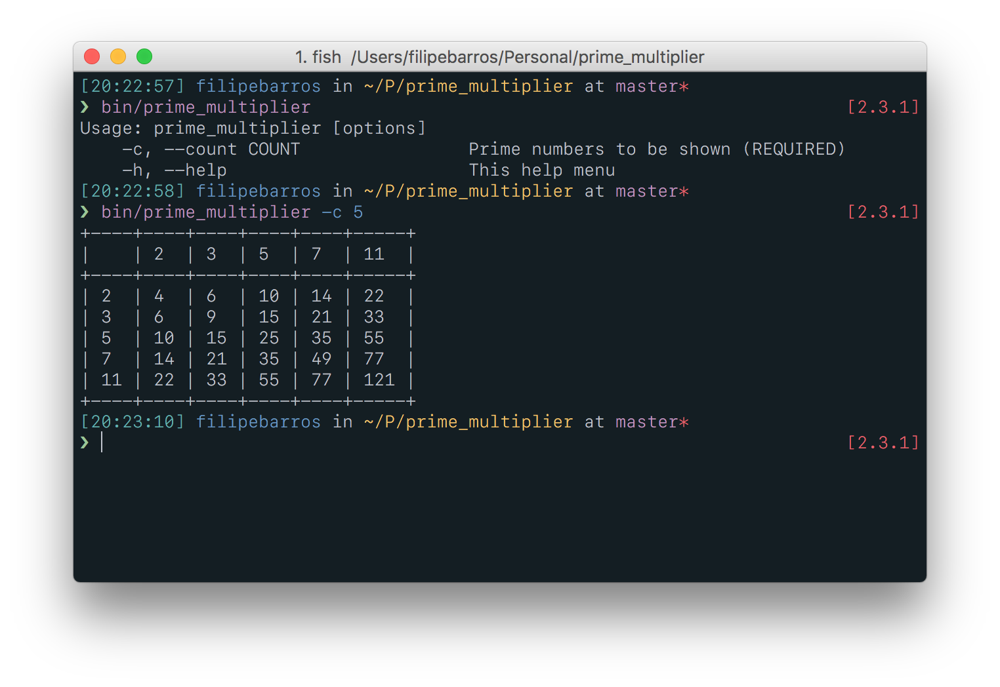

# PrimeMultiplier

This is a small ruby program to print a table of the multiplication of the first `n` prime numbers.

## Usage

1. Download the code
2. Navigate to the root folder
3. Run `bin/prime_multiplier --count #{n}`
4. See the results

## Example

Here's an image with the output of the program:

## License

The gem is available as open source under the terms of the [MIT License](http://opensource.org/licenses/MIT).
